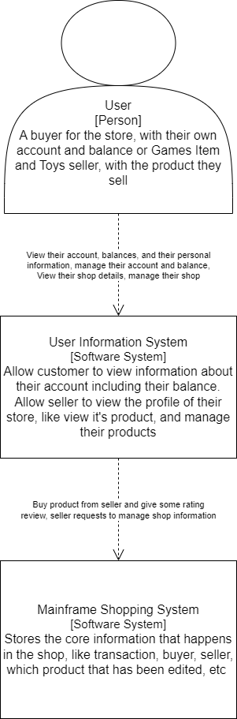
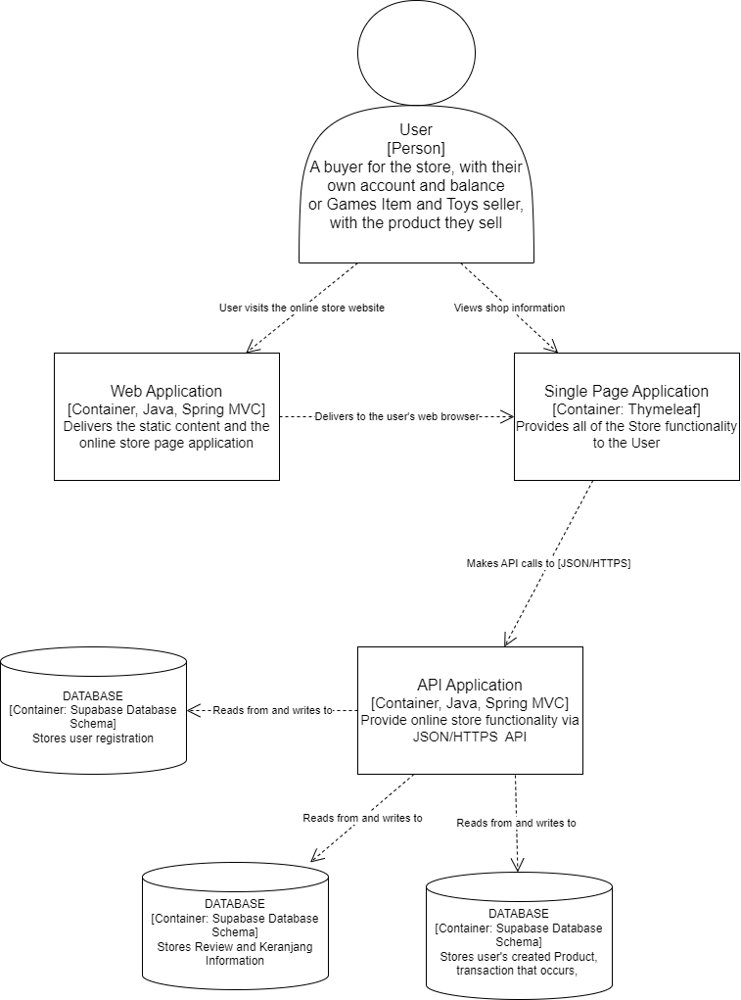
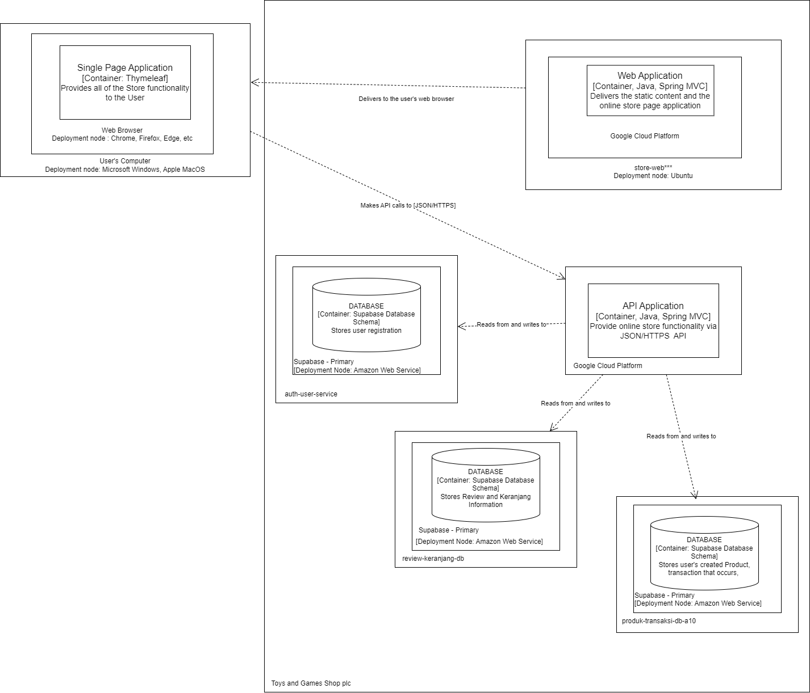
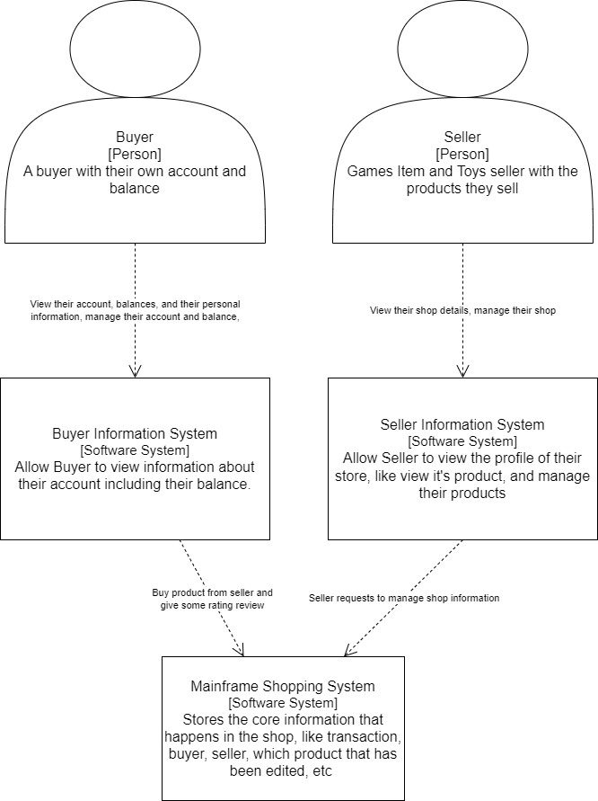
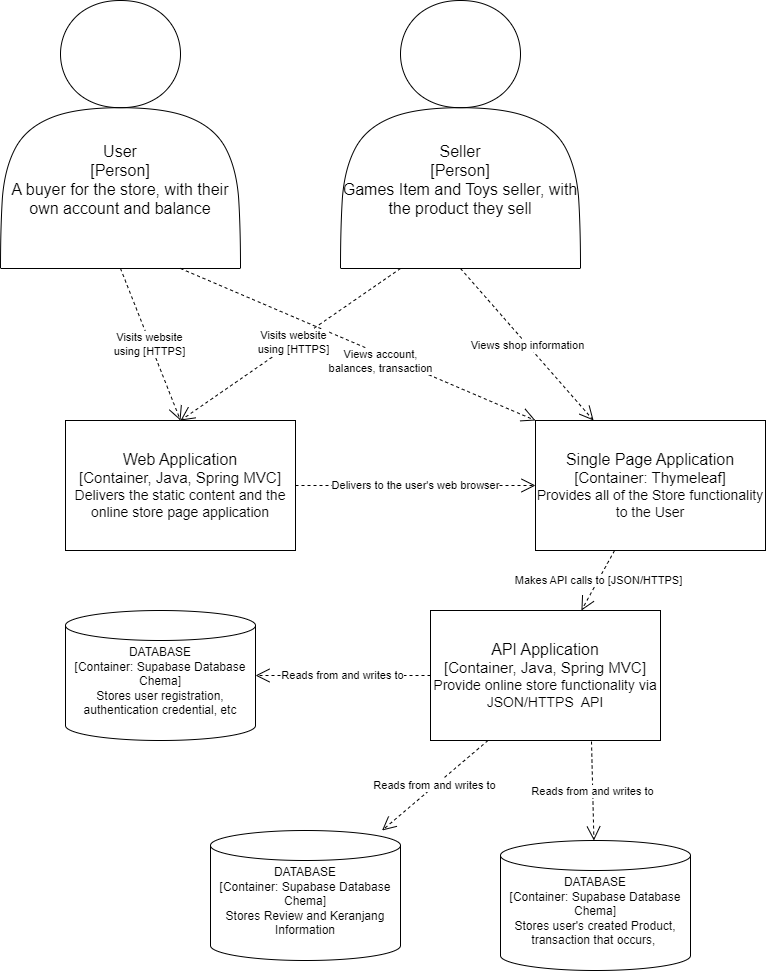
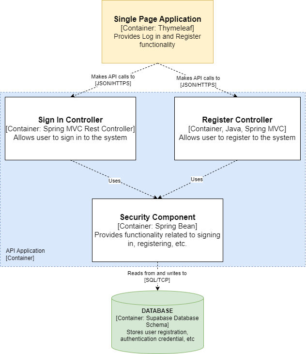
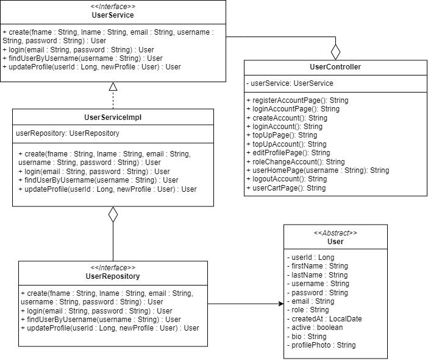

# Current Architecture Diagram
## Context Diagram

## Container Diagram

## Deployment Diagram

# Future Architecture Diagram
## Context Diagram

## Container Diagram

# Explanation of risk storming
Saat kami melakukan risk analysis, kami memutuskan untuk membagi user menjadi dua tipe yang terpisah yaitu Buyer dan Seller. Hal-hal yang menjadi pertimbangan kami adalah sebagai berikut :

1. Scalability. Kami mempertimbangkan jumlah user yang akan meningkat seiring berjalannya waktu dan transaksi akan lebih sering terjadi. Dengan memisahkan Buyer dan Seller, aplikasi mampu dilakukan scaling untuk meng-handle jumlah transaksi yang tinggi dengan risiko minimal terhadap performa aplikasi yang terdegradasi.

2. Performance. Dengan memisahkan user type beserta masing-masing servicenya, diharapkan dapat mengurangi jumlah dan lamanya page loading, terutama ketika saat-saat ramai transaksi atau saat krusial. Diharapkan dengan menganalisis risk performance pada buyer dapat mengoptimalkan proses pembelian ataupun transaksi yang ada. Dari sisi seller pun diharapkan dapat meningkatkan performa proses service nya, terutama ketika ingin mengupdate stok atau mengupdate suatu atribut lain. Dengan menganalisisis performance, kita dapat mencegah masalah-masalah seperti inefficiency akibat dari lamanya response time antara input dan output.

3. Security. Informasi pada Buyer seperti detail akun dan riwayat pembayaran sebaiknya disimpan pada tempat yang berbeda untuk menjaga keamanan dan data integrity. Sama halnya dilakukan untuk menjaga data Seller agar data yang mereka dapatkan akurat dan mampu menjadi insight yang berguna untuk meningkatkan kualitas tokonya.

---
# Individual Container and Code Diagram for Auth Service
## Nama: I Putu Gede Kimi Agastya
## NPM: 2206823695
### Container Diagram

### Code Diagram
